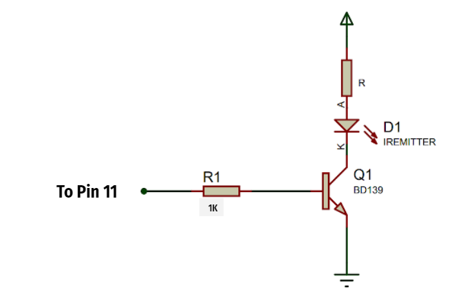

# e16-3yp-smart-infared-shooting-sport

This is the 3rd year embedded system project 

Group Members :
* E/16/320 e16329@eng.pdn.ac.lk 
* E/16/319 e16319@eng.pdn.ac.lk 
* E/16/126 e16126@eng.pdn.ac.lk

### X-TAG  Smart infrared shooting sport:

Infrared games are originated in the united states as a replicate of star wars laser wars 
which is a popular movie hit.Now laser/IR shooting sports are popular in all over the world.
There are many Commercial laser tag and Toy class guns are available in the market now.
 
 
### But why we need X-TAG which is our new smart infrared shooting sport system:

* current related product are,
* very expensive
* Companies with large indoor environments charge up to $10 for a single game.
* Not enough game modes/options.
* Not smart enough.
* Not updatable

### So we planned develop a new system which is:

* Shoot father up to 100ft
* And make cheaper to produce 
* And most importantly we want to make our system smart.

# Hardware list 

### IR emitter

This is the heart of the this project and it is very challenging when we use IR communication for this kind of
purpose.
**To shoot further we Planned used high power IR**       
	IR emitter - TSUS5202
		power=   170mW , 150mA
**Since Atmega IC cant give 100 mA for the transistor is used**
	BD139
**and a lens is used to focus**
	-   Diameter about      38mm (1.5″)

### IR reviser

 - SM0038 - TSOP1738 - 38KHz IR receiver 	
 - This Moduile has built in   
 -  signal amplifier
 -    2.5 V to 5.5 V
  
### LCD screen 16x2 with I2C module

 - standard HD44780  	
 - 5V

### sunder

 - Buzzer Piezo Bleeper Sounder  	
 - Frequency 4kHz 	
 - power - 10mA
 - 
### vibration motor
	
 - 10000RPM Metal Brush
 - 	DC 3.7V 5V  135mA-180mA

And also push button and RGB LED are used.

## Circuit Block of the gun and headband
 

### IR circuit

### IR lens

### **IR Receiver**

SM0038 - TSOP1738 IR Receiver

3 pin
 2.   38KHz
 3.   -40 to +80C
 4.   2.5 V to 5.5 V
 5.   binary (data) 
 

## **Bill of materials**

## CONTROLLER PLATFORMS

-   AtMega328 is programming using C language
### IR Library
-   Currently it is NEC IR protocol
-   38 KHz
- 8  bit is used
 

### Access and authentication

Using Email and a password players can register Xtag
Players have to verify their  Email before signed in
More detail will be on testing report

#  Back-end technologies
Firebase

- It is ideal for our Xtag mobile app.
- Cloud deployment -Firestore 
    - database helps to store real-time and synchronize game data.
- Firebase authentication library is used for authentication
    

Storage

-   Cloud Firestore
    

Fast performance, high availability, and security

# Database
 
 

- Two main collections are used to store Player data and Match data.
- Player collection will store records as documents according to the Used ID.
- Match collection will store records as documents according to the Match ID.
- Players' details of each match will be stored as a sub collection inside the relevent match document.

## Reasons behind the database
- When do a query search in a match, It will be efficient
- When player want see his paset, it will be efficient
- We can increase the efficiency of the system by deleting  old match data.
- There Are Some data in the match,which are useless later
     - Ex: isready,rescue code

# Main Functionalities
 
- How to refresh the screen when players are connected
    - Streams are used
- Syncing the game time counter
- How to set a tempid
- How to give a score to the shooter
    - Query searching is done by the killed player
 

# User Interface - Mobile Application
Develop using Futter 1.17 

### Home page

### User Profile

### SignIn and SignUp pages

	
	<width="100"/>
	 

### Connect gun and go to battle

### Create or join a battle

### Start and play

# Tests done
    1. Authentication test (Integrated  security test)
    2. Network compatibility testing
    3. Data Mapping testing
    4. Stored Procedures(Black box testing)
    5. Device compatibility testing
The report of the results of these tests are uploaded in docs file.
 [go to report](https://github.com/cepdnaclk/e16-3yp-smart-infared-shooting-sport/blob/master/test/test.md)
 
 
 # Hardware Design
 
 
 
 
 
 
 
 # User experience
 
 - Comfortable size and shape 
 - Real gaming experiece with sound effects, vibrations when shooting and LEDs
 - Mobile phone mounter
 - Reload button to reset the gun

# Implantation

- Design seperated into several parts for the ease of 3D printing

# Fabrication circuit
- Used small circuits that are connected to the main circuit for
	- Switch buttons
	- LEDs
	- Vibrator motor
	- IR emitter
	- Buzzer

- Connections are done according to the AtMega328P datasheet

 
 
