# e16-3yp-smart-infared-shooting-sport

### Team

* Group Members 
	* E/16/320 e16329@eng.pdn.ac.lk 
	* E/16/319 e16319@eng.pdn.ac.lk 
	* E/16/126 e16126@eng.pdn.ac.lk
	
* Supervisor
   	* Dr. Isuru Navinna
   	* Mr. Ziyan Marikkar 
  	* Prof. Roshan Ragel
   	* Dr. Upul Jayasinghe
   	
* Related links
   	* [Faculty website](http://eng.pdn.ac.lk/)
   	* [Department website](http://www.ce.pdn.ac.lk/)
   
   ### IMAGE
   
   
    ## TABLE OF CONTENT
   
1. >[OVERVIEW](https://github.com/cepdnaclk/e16-3yp-smart-infared-shooting-sport/blob/master/docs#overview)
2. >[GOALS](https://github.com/cepdnaclk/e16-3yp-smart-infared-shooting-sport/blob/master/docs#goals)
3. >[SPECIFICATIONS](https://github.com/cepdnaclk/e16-3yp-smart-infared-shooting-sport/blob/master/docs#specifications)
4. >[SOLUTION ARCHITECTURE](https://github.com/cepdnaclk/e16-3yp-smart-infared-shooting-sport/blob/master/docs#solution-architecture)
5. >[HARDWARE](https://github.com/cepdnaclk/e16-3yp-smart-infared-shooting-sport/blob/master/docs#hardware)
6. >[MOBILE APP.](https://github.com/cepdnaclk/e16-3yp-smart-infared-shooting-sport/blob/master/docs#backend)
7. >[BACKEND](https://github.com/cepdnaclk/e16-3yp-smart-infared-shooting-sport/blob/master/docs#Mobile-app.)
8. >[TESTING](https://github.com/cepdnaclk/e16-3yp-smart-infared-shooting-sport/blob/master/docs#testing)
9. >[BUDGET](https://github.com/cepdnaclk/e16-3yp-smart-infared-shooting-sport/blob/master/docs#budget)

## OVERVIEW

X-tag is a Smart IR shooting sport.In currrent related product are, 
 
* very expensive
* Companies with large indoor environments charge up to $10 for a single game.
* Not enough game modes/options.
* Not smart enough.
* Not updatable

	Therefore In this Project we build a tag system with a central server and a mobile application.In that manner we were able to
	Create a updatable ,smart IR tag system.Also the cost of our system will be very lower compare to current products in the market.

## GOALS

* Shoot father up to 100ft
* And make cheaper to produce 
* And most importantly we want to make our system smart.

## SPECIFICATIONS
* There are mainly 3 parts in this project .Xtag gun and the headband to shoot and receive IR,Xtag mobile application to
  Choose game modes,initialize the game and a firebase server for communicate with in the game .
*  Every gun has a cababilty of shooting more than 30m and many features like LCD screen,LED lights,vibration motors.
*  The headband is connected to gun with a wired connection and it receive the IR signals shoots by other players.
*  Also Headband has 3 LEDs to indiacate the Team colour and Another LED to blink when get shotted.Those IR receivers and LEDs are locate in every 
   4 sides in the gun.
*  Inizialize the gun before the match,selecting the team,battle mode are done with the help of the Xtag mobile application.Gun is connecting to the mobile using Bluetooth.
*  Finding the shooter,giving scores,join to a battle are done with the help of the firebase server by connecting to it through the Xtag mobile application.
*  Thanks to our system artchtecture this system is updatable(Can be added more modes more option without changing the hardware) and a smart one.

## SOLUTION ARTCHTECTURE

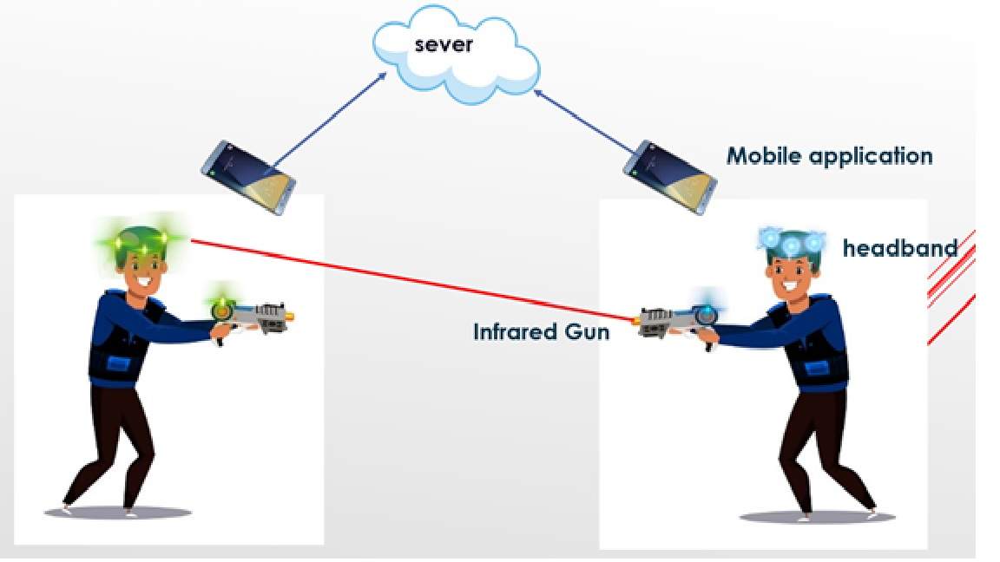

* Every player has a head to reserve IR shots and IR gun to shoot IR.
	* when the platyer shoots he shoot with some data.They are,
		* Team ID
		* Damage
		* Player ID
		
	
* Every players gun is connected to the mobile application through blutooth.
* Every phonr is connected to the our server.
* Using mobile application,
	* gun is initilized.
	* game mode is selected
* Server is used to,
	* comunicate with the gamne.
		* As a example Find who is the shooter and ,giving scores are done with the help of
		  the backend.
		  
## HARDWARE

* ### IR emitter

This is the heart of the this project and it is very challenging when we use IR communication for this kind of
purpose
* To shoot further we Planned used high power IR      
	* IR emitter - TSUS5202
	* power=   170mW , 150mA
* Since esp32 cant give 100 mA for the transistor is used 
	* BD139
* and a lens is used to focus 
	* Diameter about   -   38mm (1.5″)

* ### IR receiver

 	* SM0038 - TSOP1738 - 38KHz IR receiver 	
 	* This Moduile has built in   
	*  signal amplifier
	*   2.5 V to 5.5 V
  
* ### LCD screen 16x2 with I2C module

 	* standard HD44780  	
 	* 5V

* ### sunder

 	* Buzzer Piezo Bleeper Sounder  	
 	* Frequency 4kHz 	
 	* power - 10mA
 - 
* ### vibration motor
	
 	* 10000RPM Metal Brush
 	* DC 3.7V 5V  135mA-180mA

And also push button and RGB LED are used.

* ### IR circuit

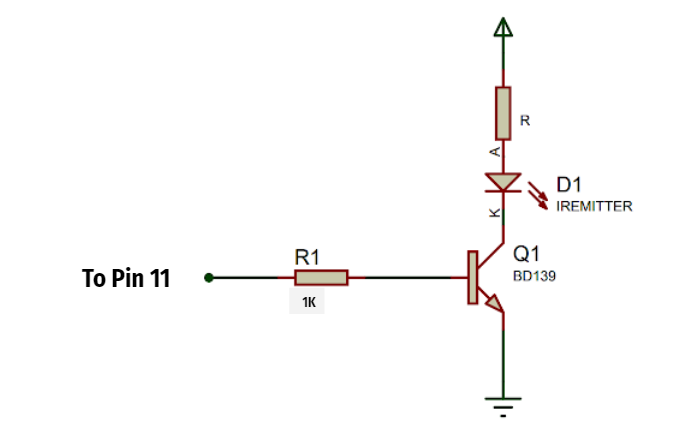
* ### IR lens
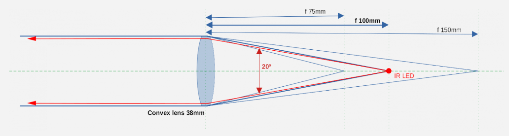

* ### IR Receiver

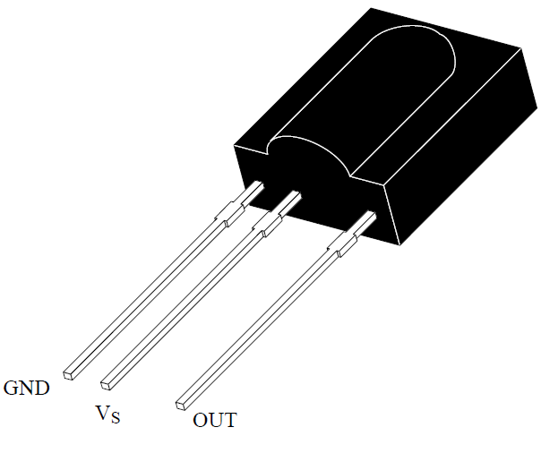
SM0038 - TSOP1738 IR Receiver

 1. 3 pin
 2.   38KHz
 3.   -40 to +80C
 4.   2.5 V to 5.5 V
 5.   binary (data) 
 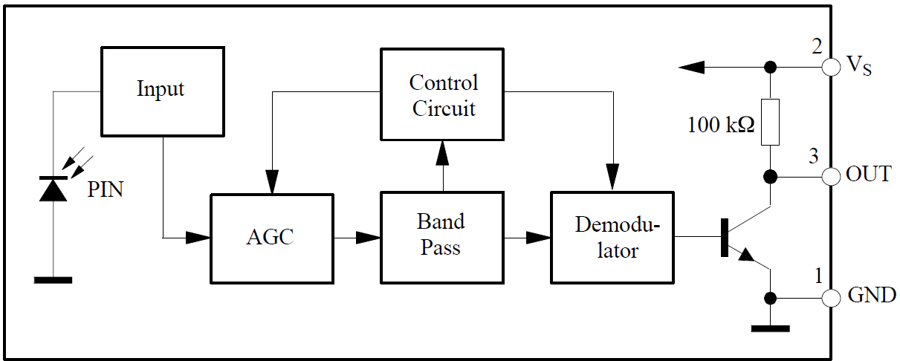

* ## CONTROLLER PLATFORMS

	* NodeMCU esp32 duel core microtroller
* ### IR Library
  	* Currently it is NEC IR protocol
   	* 38 KHz
 	* 8  bit is used
 

* ### implementation

- Design seperated into several parts for the ease of 3D printing

 
 
 
 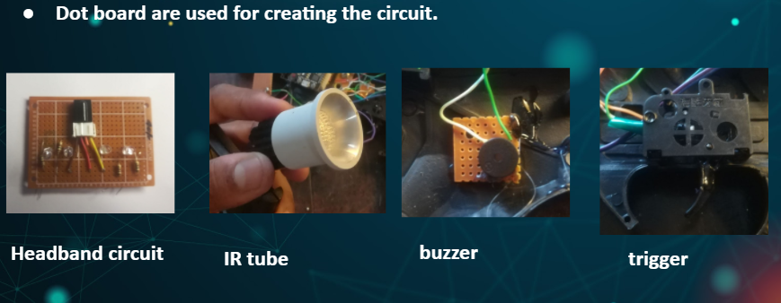
 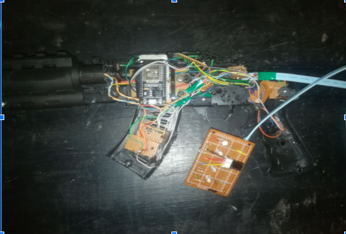
 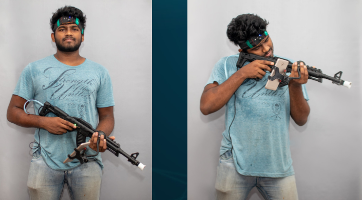
 

* ### Fabrication circuit
* Used small circuits that are connected to the main circuit for
	* Switch buttons
	* LEDs
	* Vibrator motor
	* IR emitter
	* Buzzer

* Connections are done according to the NODE MCU esp32 datasheet

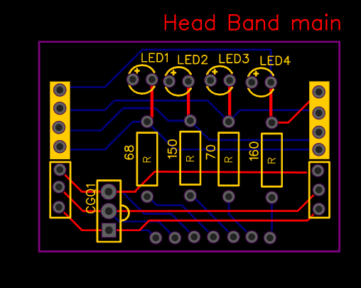

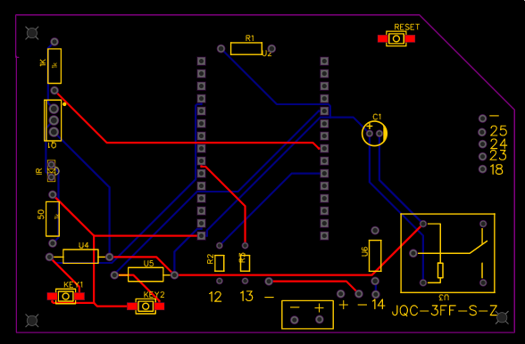

## BACKEND
* ### Access and authentication

Using Email and a password players can register Xtag
Players have to verify their  Email before signed in
More detail will be on testing report

	* It is ideal for our Xtag mobile app.
	* Cloud deployment -Firestore 
		* database helps to store real-time and synchronize game data.
	* Firebase authentication library is used for authentication
    

* ### Storage

	* Cloud Firestore

	Fast performance, high availability, and security

* ### Database
	 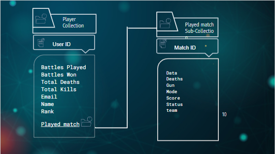
	 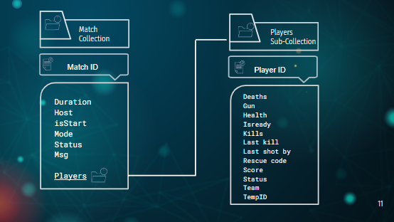

	* Two main collections are used to store Player data and Match data.
	* Player collection will store records as documents according to the Used ID.
	* Match collection will store records as documents according to the Match ID.
	* Players' details of each match will be stored as a sub collection inside the relevent match document.

* ### Reasons behind the database
	* When do a query search in a match, It will be efficient
	* When player want see his paset, it will be efficient
	* We can increase the efficiency of the system by deleting  old match data.
	* There Are Some data in the match,which are useless later
		* 	Ex: isready,rescue code

## MOBILE APP.

* ### Main Functionalities
 
	* How to refresh the screen when players are connected
	 	 * Streams are used
	* Syncing the game time counter
	* How to set a tempid
	* How to give a score to the shooter
	  	  * Query searching is done by the killed player

* ### User Interface - Mobile Application
Develop using Futter 1.17 

* ### Home page

* ### User Profile

### SignIn and SignUp pages

	
	<width="100"/>
	 

### Connect gun and go to battle

	

### Create or join a battle

	

## TESTING
* ### Xtag application testing
    1. Authentication test (Integrated  security test)
    2. Network compatibility testing
    3. Data Mapping testing
    4. Stored Procedures(Black box testing)
    5. Device compatibility testing
* software testing sumarry : https://docs.google.com/document/d/15QQ1ZPAIXyWhq7m--7BOh9n0jbu_8oZKydKhLDy0Gqo/edit?usp=sharing
* software testing report : https://docs.google.com/document/d/1bhaTQPnoYpXo6yQ9MJRpFDIS963kJpqcUUipNbIv-IE/edit?usp=sharing
 
* ### Embedded system testing

	1. Design level testing -
		* to find best IR collecting method
	3. Unit tests
		* Blutooth communication
		* IR communication	
	4. Physical test
		* Fire range
		* fire accuracy
* HArdware testing sumarry : https://docs.google.com/document/d/1yRsRNFsx3cfH2Z9USqZvHvry2KBjpZQ3aWNl-_fgJvw/edit?usp=sharing
* HArdware testing report : https://docs.google.com/document/d/1XJSeqUBuJQFIUvLsx5cCLyxi5nqX5FbRWItxmr5zCmQ/edit?usp=sharing
 

## BUDGET
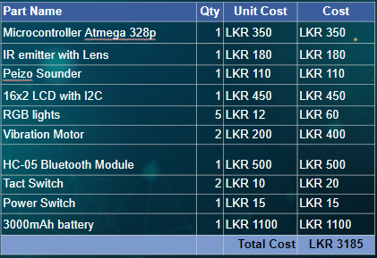

	
	
## Demonstration

The demonstration video :
 [go to video](https://drive.google.com/file/d/1a6kVjcnCTQCvDKRnqzcPr8oCJybpMAp6/view?usp=sharing)
 
 

