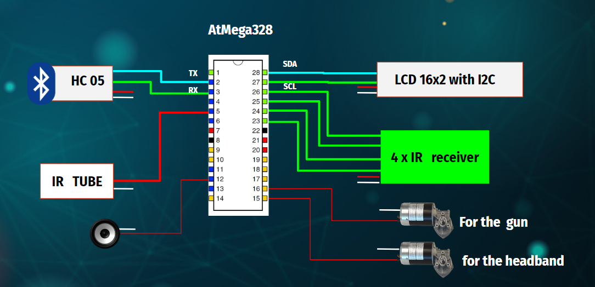
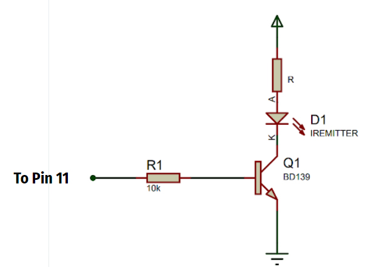
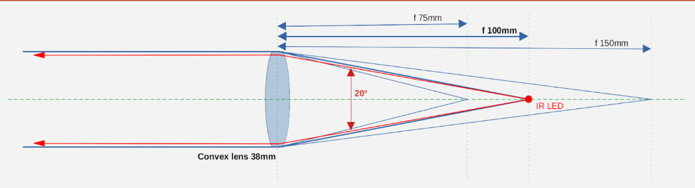
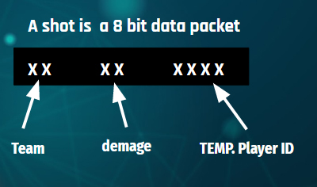

# e16-3yp-smart-infared-shooting-sport

This is the 3rd year embedded system project 

Group Members :
* E/16/320 e16329@eng.pdn.ac.lk 
* E/16/319 e16319@eng.pdn.ac.lk 
* E/16/126 e16126@eng.pdn.ac.lk

### X-TAG  Smart infrared shooting sport:

Infrared games are originated in the united states as a replicate of star wars laser wars 
which is a popular movie hit.Now laser/IR shooting sports are popular in all over the world.
There are many Commercial laser tag and Toy class guns are available in the market now.
 
 
### But why we need X-TAG which is our new smart infrared shooting sport system:

* current related product are,
* very expensive
* Companies with large indoor environments charge up to $10 for a single game.
* Not enough game modes/options.
* Not smart enough.
* Not updatable

### So we planned develop a new system which is:

* Shoot father up to 100ft
* And make cheaper to produce 
* And most importantly we want to make our system smart.

# Hardware list 

### IR emitter

This is the heart of the this project and it is very challenging when we use IR communication for this kind of
purpose.
**To shoot further we Planned used high power IR**       
	IR emitter - TSUS5202
		power=   170mW , 150mA
**Since Atmega IC cant give 100 mA for the transistor is used**
	BD139
**and a lens is used to focus**
	-   Diameter about      38mm (1.5″)

### IR reviser

 - SM0038 - TSOP1738 - 38KHz IR receiver 	
 - This Moduile has built in   
 -  signal amplifier
 -    2.5 V to 5.5 V
  
### LCD screen 16x2 with I2C module

 - standard HD44780  	
 - 5V

### sunder

 - Buzzer Piezo Bleeper Sounder  	
 - Frequency 4kHz 	
 - power - 10mA
 - 
### vibration motor
	
 - 10000RPM Metal Brush
 - 	DC 3.7V 5V  135mA-180mA

And also push button and RGB LED are used.

## Circuit Block of the gun and headband
 

### IR circuit

### IR lens

### **IR Receiver**

SM0038 - TSOP1738 IR Receiver

3 pin
 2.   38KHz
 3.   -40 to +80C
 4.   2.5 V to 5.5 V
 5.   binary (data) 
 

## **Budget**

Microcontroller-ATMega328 =  LKR 350

Infrared Emitter with lens  =  LKR 200

Piezo Sounder  =  LKR 100

16*2 LCD with I2C  =  LKR 450

RGB light *5  =  LKR 100

Vibration motor  *2  =  LKR 400

HC-05 Bluetooth module  =  LKR 400

Trigger and Reload buttons+wire  =  LKR 100

3000mAh rechargeable 5v  =  LKR 1000
#### Direct Material Cost  LKR 3100 Per unit

## CONTROLLER PLATFORMS

-   AtMega328 is programming using C language
### IR Library
-   Currently it is NEC IR protocol
-   38 KHz
- 8  bit is used
 

# Network technologies and protocols

Server

-   Amazon Elastic Compute Cloud web service (AWS - EC2)
    
-   Linux computer instance
    
-   Maximum bandwidth 25 Gbps
    

Security

-   Keep user passwords and usernames in the database using hashing technique
    
-   In a new logging, compare both password and username with the database
    
-   Server verifies and issues custom tokens identifying the user
    

Availability

to achieve high availability,

-   Elastic Load Balancing— can launch several EC2 instances and distribute traffic between them
    
-   Auto Scaling— detect when loads increase, and dynamically add more instances.
 

Scaling

-   AWS EC2 auto scaling (1 - 4 instances)
# Back-end technologies

 ## Language
Python - With structures
 ## Storage
mySQL database

the instance could disappear due to hardware failure or whatever reason
transfer mysql database directly from EC2 machine to S3bucket ?
consume more cost for bandwidth and storage

  

 ## third party application

'StoreGrid' backup software
backup your mysql
safer
compress your data & encrypt and then save in S3 storage
for less than $1.8 per month

# Main Database - Physical model
UserID 	|	UserName |	Password	 |HighScore	|  NoOfMatches |	TotalKills

# User Interface - Mobile Application
Develop using Futter 1.17 

## Home page

## SignIn and SignUp pages

	
	<width="100"/>
	 

