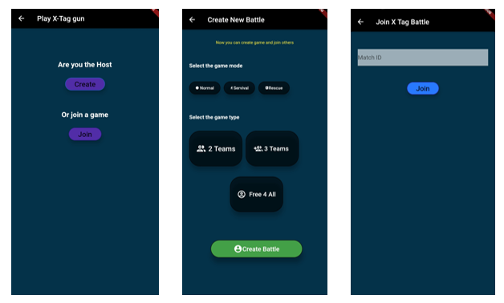
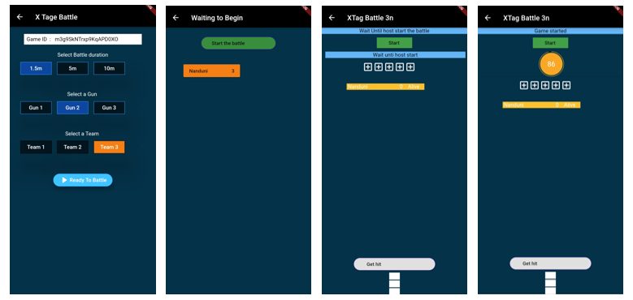

# e16-3yp-smart-infared-shooting-sport

This is the 3rd year embedded system project 

Group Members :
* E/16/320 e16329@eng.pdn.ac.lk 
* E/16/319 e16319@eng.pdn.ac.lk 
* E/16/126 e16126@eng.pdn.ac.lk

### X-TAG  Smart infrared shooting sport:

Infrared games are originated in the united states as a replicate of star wars laser wars 
which is a popular movie hit.Now laser/IR shooting sports are popular in all over the world.
There are many Commercial laser tag and Toy class guns are available in the market now.
 
 
### But why we need X-TAG which is our new smart infrared shooting sport system:

* current related product are,
* very expensive
* Companies with large indoor environments charge up to $10 for a single game.
* Not enough game modes/options.
* Not smart enough.
* Not updatable

### So we planned develop a new system which is:

* Shoot father up to 100ft
* And make cheaper to produce 
* And most importantly we want to make our system smart.

# Hardware list 

### IR emitter

This is the heart of the this project and it is very challenging when we use IR communication for this kind of
purpose.
**To shoot further we Planned used high power IR**       
	IR emitter - TSUS5202
		power=   170mW , 150mA
**Since Atmega IC cant give 100 mA for the transistor is used**
	BD139
**and a lens is used to focus**
	-   Diameter about      38mm (1.5″)

### IR reviser

 - SM0038 - TSOP1738 - 38KHz IR receiver 	
 - This Moduile has built in   
 -  signal amplifier
 -    2.5 V to 5.5 V
  
### LCD screen 16x2 with I2C module

 - standard HD44780  	
 - 5V

### sunder

 - Buzzer Piezo Bleeper Sounder  	
 - Frequency 4kHz 	
 - power - 10mA
 - 
### vibration motor
	
 - 10000RPM Metal Brush
 - 	DC 3.7V 5V  135mA-180mA

And also push button and RGB LED are used.

## Circuit Block of the gun and headband
 

### IR circuit

### IR lens

### **IR Receiver**

SM0038 - TSOP1738 IR Receiver

3 pin
 2.   38KHz
 3.   -40 to +80C
 4.   2.5 V to 5.5 V
 5.   binary (data) 
 

## **Bill of materials**

## CONTROLLER PLATFORMS

-   AtMega328 is programming using C language
### IR Library
-   Currently it is NEC IR protocol
-   38 KHz
- 8  bit is used
 

### Access and authentication

Using Email and a password players can register Xtag
Players have to verify their  Email before signed in
More detail will be on testing report

#  Back-end technologies
Firebase

- It is ideal for our Xtag mobile app.
- Cloud deployment -Firestore 
    - database helps to store real-time and synchronize game data.
- Firebase authentication library is used for authentication
    

Storage

-   Cloud Firestore
    

Fast performance, high availability, and security

# Database
 
 

- Two main collections are used to store Player data and Match data.
- Player collection will store records as documents according to the Used ID.
- Match collection will store records as documents according to the Match ID.
- Players' details of each match will be stored as a sub collection inside the relevent match document.

## Reasons behind the database
- When do a query search in a match, It will be efficient
- When player want see his paset, it will be efficient
- We can increase the efficiency of the system by deleting  old match data.
- There Are Some data in the match,which are useless later
     - Ex: isready,rescue code

# Bluetooth Connection
- Connect the gun and and mobile app using bluetooth and tested using real hardware
- No collision
- No data Losses
- Communicate within 0.2s

### Data sent form Gun to Mobile
- Killer's team, tempId and the dammage
- Gun is connected or not

### Data Sent from the Mobile to Gun
- Player team
- Player Gun
- Player health(When changed)
- Player status when Killed and rescued

# Main Functionalities
 
- How to refresh the screen when players are connected
    - Streams are used
- Syncing the game time counter
- How to set a tempid
- How to give a score to the shooter
    - Query searching is done by the killed player
 

# User Interface - Mobile Application
Develop using Futter 1.17 

### Home page

### User Profile

### SignIn and SignUp pages

	
	<width="100"/>
	 

### Connect gun and go to battle

### Connect Gun to the bluetooth

### Create or join a battle

### Start and play

# Tests done
    1. Authentication test (Integrated  security test)
    2. Network compatibility testing
    3. Data Mapping testing
    4. Stored Procedures(Black box testing)
    5. Device compatibility testing

# Test Report

## 1.	Authentication test (Integrated  security test)

### Importance : 

This is important for the security of the app and user accounts. In X-tag we save players data, rank them and track their performance. 
But no one can change the data inside an user profile without playing the game.

### How was the test done:

Done manually by testing these possibilities.

What was tested ,Results and findings:

●	Can user register with same email again
	No, but any error will not displayed 
	Time up msg should be displayed

●	Can user log in before user verification
○	No
○	Verification mail goes to the provided mail
○	Works smoothly

●	What if user forgot the password
○	Can go the forgot password option

●	What happens if the user enter the wrong password or email
○	No error message.Fixed that

●	Can user log in with multi devices at the same time
○	Yes can
○	What happen if both try to enter the same match
■	Can't create two players at the same time
■	Both or more will see the same screen

●	The limit of the sign-up quota
○	Set sign up quota to 100 per hour currently
○	(from the same ip address)

●	Sign up with a valid email
■	Results: Waits until the verification is done.(no instruction message displayed)

●	Sign up with an invalid email
■	Results: error msg displayed

●	Did not refresh the register screen when logged in
○	Fixed that issue

## 2.Network compatibility testing

### Importance : 

We tested X-tag app in the real world, network conditions can be different, Using This Test we monitored  how the app performed across different network environments.

### What we tested: 

Time taken for Selecting  gun, team and the match duration in the database.
Measured the time 25 times,

●	Mobile 2G
●	Mobile 3G 
●	Mobile 4G 
●	Wifi 4G network conditions.

### How was the test done:

	Added the following code and graphed the results.

int i = 0;
                            for (i = 0; i < 25; i++) {
                              sleep1();
                              Stopwatch stopwatch = new Stopwatch()..start();

                              try {
                                User user = _auth.currentUser;
                               //database update

                              } catch (e) {
                                print(e.toString());
                              }
                              print('change value $i ${stopwatch.elapsed}');
                            }

### Results and findings:

Time taken for Selecting  gun, team and the match duration in the database for  25 attempts are as follows. Time is in seconds.

Attempt	Wi-fi 4G	Mobile 4G	Mobile 3G	Mobile 2G
1	0.315404	0.320198	1.648746	4.293811
2	0.368186	0.313119	0.880405	1.175932
3	0.309419	0.328745	0.61963	0.60251
4	0.364689	0.314767	0.628514	0.518855
5	0.239885	0.240182	0.680837	1.031038
6	0.284624	0.308419	0.869218	2.050813
7	0.232842	0.322398	0.74932	0.354271
8	0.306113	0.314951	0.998595	0.565656
9	0.22375	0.25114	0.658921	0.376293
10	0.224903	0.222431	0.22263	6.139117
11	0.216957	0.251344	0.220462	4.044457
12	0.286734	0.320239	0.228428	0.877275
13	0.299806	1.063794	0.23024	1.462894
14	0.287429	0.668062	0.226045	1.699495
15	0.298734	0.240035	0.222595	0.596887
16	0.291522	0.242156	0.227038	0.400895
17	0.228106	0.237089	0.226708	2.820729
18	0.225475	0.245969	0.227591	0.560463
19	0.277104	0.293077	0.240537	0.451406
20	0.222439	0.298764	0.226879	0.400895
21	0.216372	0.324562	0.231915	0.560463
22	0.227422	0.392342	0.233594	0.451406
23	0.298734	0.283477	0.21868	0.400895
24	0.228106	0.322398	0.217272	      1.175932
25	0.226213	0.222431	0.248694	0.451406

Average time

Network Condition	Average time taken 
Wifi 4G 	0.268039 s
Mobile 4G 	0.333684 s
Mobile 3G 	0.455340 s
Mobile 2G	1.228552 s

 

## 3. Data Mapping testing

### Importance?
	Database testing helps in protecting the most important component of the app which is data. The correct Structure is very  import for the whole process of gaming 
### What was tested?

1.When authentication happens a player document is created.
2.when the match happening is match document is created with unique id
i). when the players are adding, nested players coll. Is created with the userid as a doc. ID
3.When match is finished is nested played match is created updated field
4.Is match database is deleted after upload the data

### How was the test done:
Manually by using application UI when we know the database integration. 

### Results and findings:

Database structure is created perfectly.
But there is a possibility,
	To lose match data when they are deleted from the ‘match’ collection.
Therefore those data were uploaded when the match was over.

And deleting a whole collection by a user is not recommended by the fire store.
How ever since we delete only the doc . under the collection.

## 4. Stored Procedures(Black box testing)

	Perform an operation from the front end (UI) of the application and check for the execution of the stored procedure and its results.

### Importance?
	
We should minimize the read and write results in to the database
	Otherwise it can be expensive.	And also the app will work efficiently.
 	

### What was tested?

●	How many times  read and write the data to the back ends.
●	Are they correct values?

### How was the test done?

Using the ui and the Cloud firestore usage interface.
When two players are in the Match,those reads are writes values are taken from the cloud usage interface.
 

	    read 		writes 		deletes

When creating a game	0	5	0
Selecting the game setting
(Team, gun ,duration)			2	3	0
Someone joining		7	10	0
Start the battle 		6	1	0
When get shot	14	7	
0
When go to the home page	0
	
8	0

1

	
### Results and findings:

●	Found that Some local data did not initialize.

●	Found some data set as null because of that
○	Therefore when we get hit,first updated local variables and then those local variables are uploaded to the database.

●	Therefore when we increase  the database values, we don't have to read and write.

## 5.  Device compatibility testing

### Importance :
	Users will use different types of devices to run this app.It is important to test Our app in different devices.
X-tag was tested across various mobile devices for confirming its compatibility.

### What was tested: 

●	How does the app works with devices with different API levels
●	Performance on each device
●	Accessibility 

### How the test was done:

 For this Robo test facility from Firebase Test lab was used. It automatically explores our app on multiple devices to find defects and report any crashes that occur.

### Results and findings:

Device	API level	Performance	Accessibility issues	Link to results
		Time to initial display 	Time to full display 		
Nexus 6P	27	2s 311ms

	11s 648ms	Content labeling

Low contrast	https://console.firebase.google.com/u/0/project/xtag-demo/testlab/histories/bh.cff1cff84a6229f8/matrices/9097277482848772899/executions/bs.df6b20a5ecbd8f7f/performance

Nexus 5	23	1s 417ms
	7s 781ms		https://console.firebase.google.com/u/0/project/xtag-demo/testlab/histories/bh.cff1cff84a6229f8/matrices/9097277482848772899/executions/bs.8b5197996df320f7/performance

Pixel 2	30	2s 626ms

	13s 923ms		https://console.firebase.google.com/u/0/project/xtag-demo/testlab/histories/bh.cff1cff84a6229f8/matrices/9097277482848772899/executions/bs.b108e0fbc4308b77/performance

Low
resolution MDPI phone 	30	2s 366ms

	15s 979ms		https://console.firebase.google.com/u/0/project/xtag-demo/testlab/histories/bh.cff1cff84a6229f8/matrices/9097277482848772899/executions/bs.a7f350076ebd7fb3/performance

Nexus 6	25	1s 431ms

	7s 287ms	Content labeling

Low contrast	https://console.firebase.google.com/u/0/project/xtag-demo/testlab/histories/bh.cff1cff84a6229f8/matrices/7091273565002506262/executions/bs.9bb48fe2fd1237a4/performance

Nexus7 clone	26	1s 287ms

	-		https://console.firebase.google.com/u/0/project/xtag-demo/testlab/histories/bh.cff1cff84a6229f8/matrices/9097277482848772899/executions/bs.145b51e5107e5168/performance

Nexus 5X	26	1s 304ms

	-	
	https://console.firebase.google.com/u/0/project/xtag-demo/testlab/histories/bh.cff1cff84a6229f8/matrices/9097277482848772899/executions/bs.c2253e72294b2358/performance

 

Few devices found out that there was a labeling error when registering.
	-fixed that
-Evey devices was passed the test
