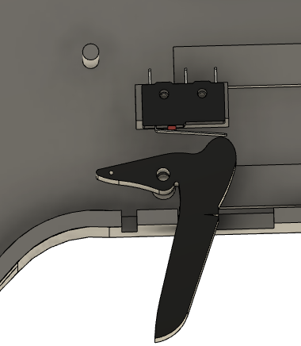
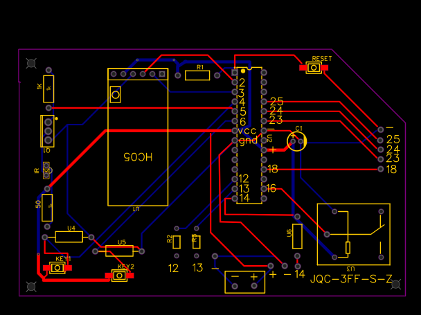

# e16-3yp-smart-infared-shooting-sport

This is the 3rd year embedded system project 

Group Members :
* E/16/320 e16329@eng.pdn.ac.lk 
* E/16/319 e16319@eng.pdn.ac.lk 
* E/16/126 e16126@eng.pdn.ac.lk

   
  
   
    ## TABLE OF CONTENT
   
1. OVERVIEW
2. GOALS
3. SOLUATION ARTECHTURE
4. HARDWARE LIST
5. SYSTEM OVERVIEW
6. HARDWARE DESIGN
7. IMPLEMENTATION
8. Tests
9. BILL OF MATERIALS

## OVERVIEW

Infrared games are originated in the united states as a replicate of star wars laser wars 
which is a popular movie hit.Now laser/IR shooting sports are popular in all over the world.
There are many Commercial laser tag and Toy class guns are available in the market now.
 

### But why we need X-TAG which is our new smart infrared shooting sport system:

* current related product are,
* very expensive
* Companies with large indoor environments charge up to $10 for a single game.
* Not enough game modes/options.
* Not smart enough.
* Not updatable

## GOALS

* Shoot father up to 100ft
* And make cheaper to produce 
* And most importantly we want to make our system smart.
## SOLUTION ARTCHTECTURE

Every player has a head to reserve IR shots and IR gun to shoot IR.
	when platyer shoot he shoot with some data.They are,
	
Every players gun is connected to the mobile application through blutooth.
Every phonr is connected to the our server.
Using mobile application,
	* gun is initilized.
	* game mode is selected
Server is used to,
	*comunicate with the gamne.
		As a example Find who is the shooter and ,giving scores are done with the help of
		the backend.
## Hardware list 

### IR emitter

This is the heart of the this project and it is very challenging when we use IR communication for this kind of
purpose.
**To shoot further we Planned used high power IR**       
	IR emitter - TSUS5202
		power=   170mW , 150mA
**Since esp32 cant give 100 mA for the transistor is used**
	BD139
**and a lens is used to focus**
	-   Diameter about      38mm (1.5″)

### IR reviser

 - SM0038 - TSOP1738 - 38KHz IR receiver 	
 - This Moduile has built in   
 -  signal amplifier
 -    2.5 V to 5.5 V
  
### LCD screen 16x2 with I2C module

 - standard HD44780  	
 - 5V

### sunder

 - Buzzer Piezo Bleeper Sounder  	
 - Frequency 4kHz 	
 - power - 10mA
 - 
### vibration motor
	
 - 10000RPM Metal Brush
 - 	DC 3.7V 5V  135mA-180mA

And also push button and RGB LED are used.

### IR circuit

### IR lens

### **IR Receiver**

SM0038 - TSOP1738 IR Receiver

3 pin
 2.   38KHz
 3.   -40 to +80C
 4.   2.5 V to 5.5 V
 5.   binary (data) 
 

## CONTROLLER PLATFORMS

-   NodeMCU esp32 duel core microtroller
### IR Library
-   Currently it is NEC IR protocol
-   38 KHz
- 8  bit is used
 
 
## SYSTEM OVERVIEW

###BACKEND
### Access and authentication

Using Email and a password players can register Xtag
Players have to verify their  Email before signed in
More detail will be on testing report

#  Back-end technologies
Firebase

- It is ideal for our Xtag mobile app.
- Cloud deployment -Firestore 
    - database helps to store real-time and synchronize game data.
- Firebase authentication library is used for authentication
    

Storage

-   Cloud Firestore
    

Fast performance, high availability, and security

### Database
 
 

- Two main collections are used to store Player data and Match data.
- Player collection will store records as documents according to the Used ID.
- Match collection will store records as documents according to the Match ID.
- Players' details of each match will be stored as a sub collection inside the relevent match document.

### Reasons behind the database
- When do a query search in a match, It will be efficient
- When player want see his paset, it will be efficient
- We can increase the efficiency of the system by deleting  old match data.
- There Are Some data in the match,which are useless later
     - Ex: isready,rescue code

### Main Functionalities
 
- How to refresh the screen when players are connected
    - Streams are used
- Syncing the game time counter
- How to set a tempid
- How to give a score to the shooter
    - Query searching is done by the killed player
 

### User Interface - Mobile Application
Develop using Futter 1.17 

### Home page

### User Profile

### SignIn and SignUp pages

	
	<width="100"/>
	 

### Connect gun and go to battle

### Create or join a battle

### Start and play

## Tests
    1. Authentication test (Integrated  security test)
    2. Network compatibility testing
    3. Data Mapping testing
    4. Stored Procedures(Black box testing)
    5. Device compatibility testing
The report of the results of these tests are uploaded in docs file.
 [go to report](https://github.com/cepdnaclk/e16-3yp-smart-infared-shooting-sport/blob/master/test/test.md)
 
 
 ## Hardware Design
 
 
 
 
 
 
 
 ### User experience
 
 - Comfortable size and shape 
 - Real gaming experiece with sound effects, vibrations when shooting and LEDs
 - Mobile phone mounter
 - Reload button to reset the gun

### Features and functionalities

- Trigger functionality
- Mobile phone mountable bar
- Reset button
- Rechargeable power bank

## Implantation

- Design seperated into several parts for the ease of 3D printing

 
 
 
 
 
 
 

### Fabrication circuit
- Used small circuits that are connected to the main circuit for
	- Switch buttons
	- LEDs
	- Vibrator motor
	- IR emitter
	- Buzzer

- Connections are done according to the AtMega328P datasheet

 
 ### Embedded sytem 
 ### progress 

 
 currently we are  programming and Testing the Hardware.
And we  Have complete two guns in the bread board with main functions.
IR sending,Trigger button,IR reserving and buzzer are perfectly working right now.
And also Mobile app is connected with the blutooth now.
We have already ran some tests and there are more test in the shedule. 
 

 ### Programme Architecture
AtMega328p has 2 external interrupt pins.
And it is a single core Microcontroller.
Trigger (To shoot IR) interrupts (Pin 3)  is used.
To Collect IR when we used Polling methods ,
Cant get shot while shooting.
When we used interrupt method it solves.But when 
Face to face shooting happens some shots did not process.
 
## Tests

-Design level testing -to find best IR collecting method
-Some Unit tests

-Physical test - With the IR tube
-Debug tests
-System Integration Tests

### Design Level testing
 

-Simulate face to face shooting of two players
-Have shot 50 shots at a time ,and repeat the process 4 times
-To pull the trigger 3rd microcontroller is used
-And randomly press the  both trigger
-5 shots per a second(Fire rate)

### Design Level testing To find suitable IR collect method

how its done,
-Simulate face to face shooting of two players
-Have shot 50 shots at a time ,and repeat the process 4 times
-To pull the trigger 3rd microcontroller is used
-And randomly press the  both trigger
-5 shots per a second(Fire rate)

### Results
Polling method Out of 50 shots average only 26 shots are processed
In interrupt method Out of 50 shots average only 35 shots are processed.
 There fore we planned to continue wqith the Interrput method.
 But it not works round 70% times .However,
-Face to face shooting in a combat field is very rare.
-Fair for everyone
### To make it perfect duel core microcoltroller is needed
We planned to test our cordes in the NodeMCU ESP32 dual core microcontroller
-Programming architecture will be the same
-Since we are using C language its very easy Continue from there	
-IR library also available for the nodeMCU

### units tests 
### Done with real hardware
### IR shooting
→ Work perfectly
### IR Capturing  
-When multiple units are connected parallelly
-If more units reserves a same code at the same time  → Works perfectly
-If multiple units reserves different cords at the same time → Only    read one shot
### Bluetooth communication
Works perfectly

### Physical testing of the IR tube
Firing range testing

-currently it can shoot up 
### Planned to ,
-fine tune the range with the focus lens
-Give more power using the transistor
-Goal is to Shoot more than 100 ft

### Accuray testing
### If the IR beam is not focused enough
-It is too easy to get a kill
-Not challenging enough

### If the IR beam is focused too much
-Even when u hit to head ,It did not count as a shot
-Should tune with tube diameter and the lens power
-Scope adjustments

 
  

### Other planned tests
### Debug tests
-Watch window test
-Register view window test
### System integration testing

	

## BILL OF MATERIALS

	

 

 

	

	

 

 

	

	

 

 

	

 

 

 
 

	

 

 

 

